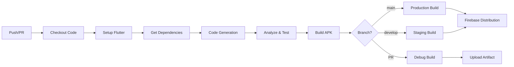

# 🚀 Firebase App Distribution - Guia de Configuração

Este guia explica como configurar o CI/CD para distribuir automaticamente o app Costruttore via Firebase App Distribution.

## 📋 Pré-requisitos

1. Conta no Firebase com projeto configurado
2. Repositório no GitHub
3. Keystore Android para assinatura de builds
4. Service Account do Firebase com permissões adequadas

## 🔧 Configuração Inicial

### 1. Firebase Console

#### 1.1 Criar App no Firebase
```bash
# Acesse: https://console.firebase.google.com
# Navegue até: Project Settings > General
# Adicione um app Android (se ainda não existir)
```

#### 1.2 Ativar App Distribution
```bash
# No Firebase Console:
# 1. Vá em "Release & Monitor" > "App Distribution"
# 2. Clique em "Get Started"
# 3. Configure grupos de testadores
```

#### 1.3 Criar Grupos de Testadores
```bash
# Crie os seguintes grupos:
- testers-development: Para builds de desenvolvimento (todas as branches exceto main)
- testers-production: Para builds de produção (apenas branch main)
```

### 2. Service Account

#### 2.1 Criar Service Account
```bash
# 1. Acesse: https://console.cloud.google.com
# 2. Selecione seu projeto Firebase
# 3. Vá em "IAM & Admin" > "Service Accounts"
# 4. Clique em "Create Service Account"
# 5. Nome: "github-actions-firebase-distribution"
# 6. Role: "Firebase App Distribution Admin"
# 7. Clique em "Create Key" > JSON
# 8. Salve o arquivo JSON
```

#### 2.2 Preparar Service Account para GitHub
```bash
# Copie todo o conteúdo do arquivo JSON
# Você vai precisar adicionar isso como secret no GitHub
```

### 3. Keystore Android

#### 3.1 Criar Keystore (se não tiver)
```bash
keytool -genkey -v -keystore keystore.jks \
  -keyalg RSA -keysize 2048 -validity 10000 \
  -alias costruttore

# Anote:
# - Store password
# - Key password
# - Key alias
```

#### 3.2 Converter Keystore para Base64
```bash
# Linux/Mac:
base64 -i keystore.jks -o keystore.base64.txt

# Windows (PowerShell):
[Convert]::ToBase64String([IO.File]::ReadAllBytes("keystore.jks")) | Out-File keystore.base64.txt
```

### 4. GitHub Secrets

Configure os seguintes secrets no GitHub:

```bash
# Acesse: Settings > Secrets and variables > Actions > New repository secret
```

#### Secrets Necessários:

| Secret Name | Descrição | Como Obter |
|------------|-----------|------------|
| `KEYSTORE_BASE64` | Keystore em Base64 | Arquivo `keystore.base64.txt` |
| `KEY_ALIAS` | Alias da chave | Usado ao criar keystore |
| `KEY_PASSWORD` | Senha da chave | Usado ao criar keystore |
| `STORE_PASSWORD` | Senha do keystore | Usado ao criar keystore |
| `FIREBASE_SERVICE_ACCOUNT` | Service Account JSON | Conteúdo completo do JSON |
| `FIREBASE_APP_ID_ANDROID_DEVELOPMENT` | App ID Development | Firebase Console > Project Settings |
| `FIREBASE_APP_ID_ANDROID_PRODUCTION` | App ID Production | Firebase Console > Project Settings |

#### Como Adicionar Secrets:

```bash
# 1. Vá para: https://github.com/SEU_USUARIO/SEU_REPO/settings/secrets/actions
# 2. Clique em "New repository secret"
# 3. Adicione cada secret da tabela acima
```

### 5. Configurar Flavors no Android

Verifique se o arquivo `android/app/build.gradle.kts` tem os flavors configurados:

```kotlin
android {
    // ...
    
    flavorDimensions += "environment"
    
    productFlavors {
        create("development") {
            dimension = "environment"
            applicationIdSuffix = ".dev"
            versionNameSuffix = "-dev"
            resValue("string", "app_name", "Costruttore Dev")
        }
        
        create("staging") {
            dimension = "environment"
            applicationIdSuffix = ".staging"
            versionNameSuffix = "-staging"
            resValue("string", "app_name", "Costruttore Staging")
        }
        
        create("production") {
            dimension = "environment"
            resValue("string", "app_name", "Costruttore")
        }
    }
}
```

## 🔄 Fluxo de CI/CD

### Branches e Ambientes

| Branch | Ambiente | Distribuição | Testadores |
|--------|----------|--------------|------------|
| `main` | Production | Automática | testers-production |
| Qualquer outra | Development | Automática | testers-development |

**Exemplos:**
- `develop` → Development
- `feature/nova-funcionalidade` → Development
- `hotfix/correcao` → Development
- `main` → Production

### Triggers

O workflow é executado quando:

1. **Push para `main`**: Build production + distribuição
2. **Push para `develop`**: Build staging + distribuição
3. **Pull Request**: Build debug (sem distribuição)
4. **Manual**: Via GitHub Actions UI

### Processo de Build



## 📱 Distribuição Manual

### Via Firebase CLI

```bash
# Instalar Firebase CLI
npm install -g firebase-tools

# Login
firebase login

# Distribuir APK
firebase appdistribution:distribute \
  build/app/outputs/flutter-apk/app-production-release.apk \
  --app YOUR_APP_ID \
  --groups "testers-production" \
  --release-notes "Manual distribution"
```

### Via GitHub Actions UI

```bash
# 1. Vá para: Actions > Firebase App Distribution
# 2. Clique em "Run workflow"
# 3. Selecione a branch
# 4. Adicione release notes (opcional)
# 5. Clique em "Run workflow"
```

## 🧪 Testando o Workflow

### 1. Teste Local

```bash
# Build local para verificar se compila
flutter build apk --release --flavor production

# Verificar se o APK foi gerado
ls -lh build/app/outputs/flutter-apk/
```

### 2. Teste no GitHub

```bash
# Criar branch de teste
git checkout -b test/ci-cd

# Fazer commit
git add .
git commit -m "test: CI/CD workflow"

# Push
git push origin test/ci-cd

# Criar Pull Request e verificar se o workflow executa
```

## 🔒 Segurança

### Arquivos Protegidos no .gitignore

```gitignore
# Keystore
*.jks
*.keystore
android/key.properties

# Service Account
service-account-*.json
firebase-app-distribution-*.json

# Secrets
.env
.env.*
secrets/
credentials/
```

### Boas Práticas

1. ✅ **NUNCA** commite keystores ou service accounts
2. ✅ Use secrets do GitHub para credenciais
3. ✅ Rotacione service accounts periodicamente
4. ✅ Use diferentes keystores para staging e production
5. ✅ Mantenha backups seguros dos keystores
6. ✅ Documente senhas em local seguro (1Password, LastPass, etc)

## 📊 Monitoramento

### Ver Builds no GitHub

```bash
# Acesse: https://github.com/SEU_USUARIO/SEU_REPO/actions
# Clique no workflow "Firebase App Distribution"
# Veja logs detalhados de cada step
```

### Ver Distribuições no Firebase

```bash
# Acesse: https://console.firebase.google.com
# Vá em: Release & Monitor > App Distribution
# Veja histórico de releases e downloads
```

## 🐛 Troubleshooting

### Erro: "Keystore not found"

```bash
# Verifique se o secret KEYSTORE_BASE64 está configurado
# Verifique se o decode está funcionando no workflow
```

### Erro: "Service account permissions"

```bash
# Verifique se o service account tem a role:
# "Firebase App Distribution Admin"
```

### Erro: "App ID not found"

```bash
# Verifique se os secrets FIREBASE_APP_ID_* estão corretos
# Formato: 1:123456789:android:abc123def456
```

### Build falha no analyze/test

```bash
# O workflow continua mesmo com erros (continue-on-error: true)
# Mas é recomendado corrigir os erros antes de distribuir
```

## 📚 Recursos Adicionais

- [Firebase App Distribution Docs](https://firebase.google.com/docs/app-distribution)
- [GitHub Actions Docs](https://docs.github.com/en/actions)
- [Flutter Build Modes](https://docs.flutter.dev/testing/build-modes)
- [Android App Signing](https://developer.android.com/studio/publish/app-signing)

## 🎯 Próximos Passos

1. [ ] Configurar todos os secrets no GitHub
2. [ ] Testar workflow com Pull Request
3. [ ] Fazer primeiro deploy para staging
4. [ ] Adicionar testadores nos grupos do Firebase
5. [ ] Configurar notificações de build
6. [ ] Implementar versionamento automático
7. [ ] Adicionar build iOS (quando tiver certificados)

## 📝 Checklist de Deploy

Antes de fazer o primeiro deploy:

- [ ] Todos os secrets configurados no GitHub
- [ ] Keystore criado e em Base64
- [ ] Service Account com permissões corretas
- [ ] Grupos de testadores criados no Firebase
- [ ] Flavors configurados no Android
- [ ] .gitignore atualizado
- [ ] Workflow testado localmente
- [ ] Documentação revisada

---

**Made with Bob** 🤖

Para dúvidas ou problemas, abra uma issue no repositório.